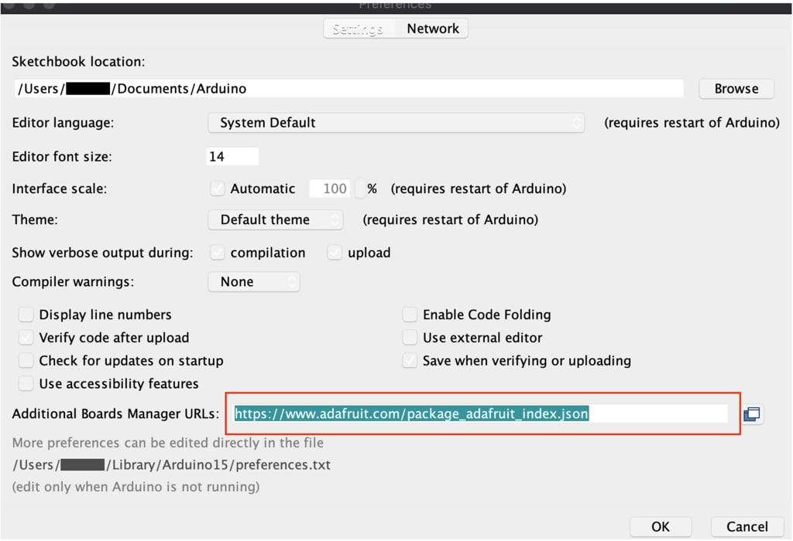

# VHP Vibro Glove Program

## Setup & Installation Guide

### 0. Download and install Arduino IDE

Begin by downloading and installing the [Arduino IDE](https://support.arduino.cc/hc/en-us/articles/360019833020-Download-and-install-Arduino-IDE).

### 1. Download this program

Select the green **"Code"** button on the page, and select the Download ZIP option from the dropdown.  
Extract the folder, and open the .ino file using the Arduino IDE.

### 2. Install the Audio-to-Tactile Arduino library

Next, you will want to download Google's Audio-to-Tactile library for Arduino.

Download the ZIP file from their GitHub, [linked here](https://github.com/google/audio-to-tactile/archive/refs/heads/main.zip).

Now, [import the library](https://docs.arduino.cc/software/ide-v1/tutorials/installing-libraries#importing-a-zip-library) in the Arduino IDE by navigating to Sketch > Include Library > Add .ZIP Library.  
Select the audio-to-tactile ZIP file to install the library.

### 3. Install additional libraries

Using the same steps as before, download the Adafruit SPIFlash ZIP file from GitHub, [linked here](https://github.com/adafruit/Adafruit_SPIFlash/archive/refs/heads/master.zip).  
Also download the Adafruit SdFat Library from GitHub, [linked here](https://github.com/adafruit/SdFat/archive/refs/heads/master.zip)

Then, import each library using the ZIP file in the same manner as before.

### 4. Add the Adafruit nRF52 board to Arduino

Go to Arduino Preferences. Add http://adafruit.github.io/arduino-board-index/package_adafruit_index.json to Additional Board Manager URLs. For additional details see [Adafruit installation guide.](https://learn.adafruit.com/introducing-the-adafruit-nrf52840-feather/arduino-bsp-setup)

On the left sidebar of the Arduino IDE, select the Boards Manager tab.

Search for "Adafruit nRF52", and select install on the package.

Then, connect the board to the computer using a USB cable.

Hopefully, the board will now be available to select at near the top of the Arduino IDE.

If the board does not show, try removing the battery if there is one, make sure it is turned on, and hold the reset button while plugging it in.

### 5. Install Arduino CLI (optional)

Follow [the instructions](https://github.com/arduino/arduino-cli) to install Arduino CLI. It uses the same libraries as Arduino IDE.

### 6. Upload the program to the board

Simply press the upload button at the top of the Arduino IDE (the arrow).

The Arduino IDE will output information about the compilation and upload.  
If it is unsuccessful, try once more. If an error persists, it may require a closer look.

### Now you are finished!

We hope this program helps you on your journey.

Please create an "issue" in the Issues tab of this GitHub repository if you would like to see something added.
